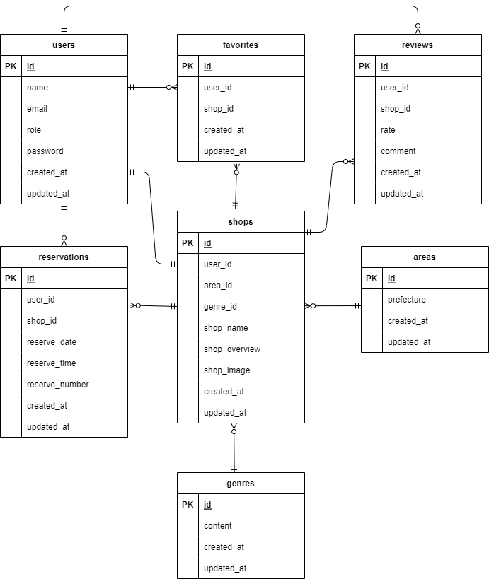

#アプリメーション名  
Rese（飲食店予約アプリ）

##作成した目的  
Advance タームでのアプリ作製

##機能一覧

- 会員登録画面
- ログイン画面
- 飲食店一覧ページ
  - 地域、ジャンル、店名から絞り込み検索できる機能
  - お気に入り登録機能
  - お気に入り解除機能
- 飲食店詳細ページ
  - 予約日、予約時間、予約人数を選択すると予約ができる
- 予約完了ページ
- マイページ
  - 予約状況とお気に入り店舗を確認できる
  - Stripe 決済
  - QR コード表示
- 予約変更ページ
  - マイページから、予約日時または予約人数を変更できる
- レビューページ
- 管理画面
  - 店舗代表者は店舗情報の作成、更新と予約情報の確認ができる
  - 管理者は店舗代表者を作成できる
- メニュー画面
  - ハンバーガーメニューをクリックすると表示される
    - ログイン時は、マイページとログアウトが選択できる
    - 未ログイン時は、会員登録とログインが選択できる

##使用技術

- 使用技術
  - Laravel 8.x
  - PHP 7.4.9
  - MySQL 8.0.26
  - Stripe

##テーブル設計

users テーブル

| カラム名 | 型           | 説明                                                   |
| -------- | ------------ | ------------------------------------------------------ |
| name     | varchar(255) | ユーザ－名                                             |
| email    | varchar(255) | メールアドレス（ユニークキー）                         |
| role     | varchar(255) | 権限 管理者は admin、店舗代表者は owner、（NULL 許容） |
| password | varchar(255) | パスワード                                             |

reservations テーブル

| カラム名       | 型              | 説明                     |
| -------------- | --------------- | ------------------------ |
| user_id        | bigint unsigned | 外部キー(users テーブル) |
| shop_id        | bigint unsigned | 外部キー(shops テーブル) |
| reserve_date   | date            | 予約日                   |
| reserve_time   | time            | 予約時間                 |
| reserve_number | tinyint         | 予約人数                 |

favorites テーブル

| カラム名 | 型              | 説明                     |
| -------- | --------------- | ------------------------ |
| user_id  | bigint unsigned | 外部キー(users テーブル) |
| shop_id  | bigint unsigned | 外部キー(shops テーブル) |

shops テーブル

| カラム名      | 型              | 説明                      |
| ------------- | --------------- | ------------------------- |
| user_id       | bigint unsigned | 外部キー(users テーブル)  |
| area_id       | bigint unsigned | 外部キー(areas テーブル)  |
| genre_id      | bigint unsigned | 外部キー(genres テーブル) |
| shop_name     | varchar(255)    | 店舗名                    |
| shop_overview | varchar(255)    | 店舗概要                  |
| shop_image    | text            | 店舗画像                  |

genres テーブル

| カラム名 | 型     | 説明           |
| -------- | ------ | -------------- |
| content  | string | ジャンルの内容 |

reviews テーブル

| カラム名 | 型              | 説明                     |
| -------- | --------------- | ------------------------ |
| user_id  | bigint unsigned | 外部キー(users テーブル) |
| shop_id  | bigint unsigned | 外部キー(shops テーブル) |
| rate     | tinyint         | 星評価(低 1~5 高)        |
| comment  | text            | レビュー内容             |

areas テーブル

| カラム名   | 型           | 説明     |
| ---------- | ------------ | -------- |
| prefecture | varchar(255) | 都道府県 |

##ER 図

##環境構築

- Docker ビルド

  1. git clone git@github.com:coachtech-material/laravel-docker-template.git
  2. docker-compose up -d --build

- Docker 環境構築

  1. docker-compose exec php bash
  2. composer install
  3. .env.example ファイルから.env を作成し、環境変数を変更
  4. php artisan key:generate
  5. php artisan migrate
  6. php artisan db:seed

##URL

- 開発環境:http://localhost/
- phpMyAdmin:http://localhost:8080/
